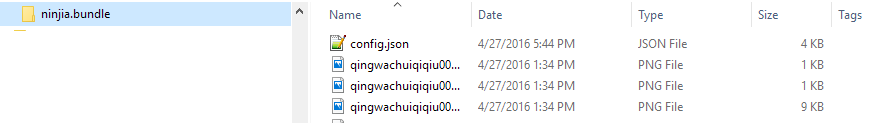

# 目录结构

魔法文件是一个`zip`包文件，其包内文件结构如下

|文件、目录名|类型|说明|必要|数量|
|--|--|--|--|--|
|`*.bundle`|顶级目录|zip包根目录下*有且只有*一个以`.bundle`为扩展名的子目录（`OSX`上显示为`bundle`包），目录内包含其余所有配置和动画文件|是|`1`|
|`config.json`|魔法配置文件|`.bundle`目录下唯一的配置文件，记录动画文件的索引和动画播放选项|是|`1`|
|`*.png`|图片序列帧文件|文件|组成动画的帧文件，每个文件对应动画中的一帧，**与视频文件互斥**|否|一个或多个|
|`*.mp4`|全屏视频文件|文件|视频动画文件，**与序列帧文件互斥**|否|`1`|

# 示例
魔法文件`ninjia.zip`包含如下内容
+ 顶级目录`ninjia.bundle`
+ 配置文件`nijia.bundle/config.json`
+ 一组序列帧文件qingwachuiqiqiu00*.png

